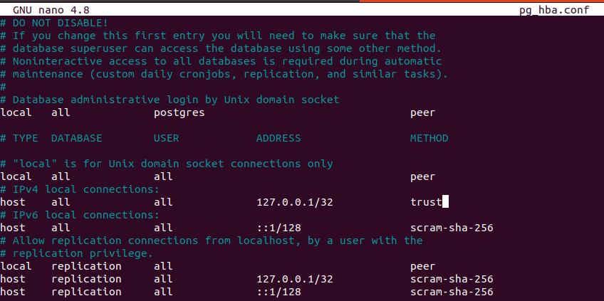
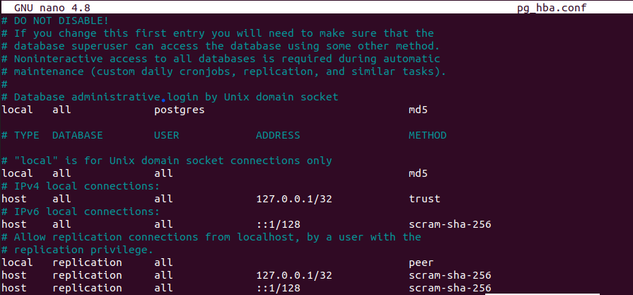

# Requirements

Following are the requirements before proceeding:

1. python 3.8.x
2. pip 20.x.x
3. postgresql 14

# One Step before proceeding

Before proceeding, there's a few changes you need to do in pg_hba.conf file. To access the file, run the following command:
`sudo nano /etc/postgresql/14/main/pg_hba.conf`
After that, scroll down till you see this:

Change the IPv4 local connection access from `scram-sha-256` to `trust`. This will enable using postgres from the main linux user.

After committing this change, restart postgresql bu running `sudo service postgresql restart`.

# Database setup

After you have made this change, run [dump.sh](dump.sh) file only once. This will create the database, insert values, create roles and install the required python-pip dependencies. This file must be run only once.

# Running the server

Once this is finished, run [start.sh](start.sh). This will bring the flask app up.

Open (http://127.0.0.1:8080) to access the home page.

# IMPORTANT

Do note that after building the database, your default password to access psql will be now `post_123`. However, you will not be able to access the psql shell quite yet. You will need to make one more change.

Reopen the pg_hba.conf file by running: `sudo nano /etc/postgresql/14/main/pg_hba.conf`.
Scroll down till you see this:

Change the "Database administrative login access" from `peer` to `md5`. Similarly, under "local" as well, change from `peer` to `md5`.

After committing this change, restart postgresql bu running `sudo service postgresql restart`.
Now, whenever you access postgres shell, you will be prompted to enter the password for postgres user. Just enter `post_123`.

If you wish to remove this, you will not be able to access the databse as the admin, mod or staff roles.
Go to the postgres shell and run the following command:
`alter role postgres with password '';`

Once you do this, revert the changes made in the pg_hba.conf file as well from "md5" to "peer".
